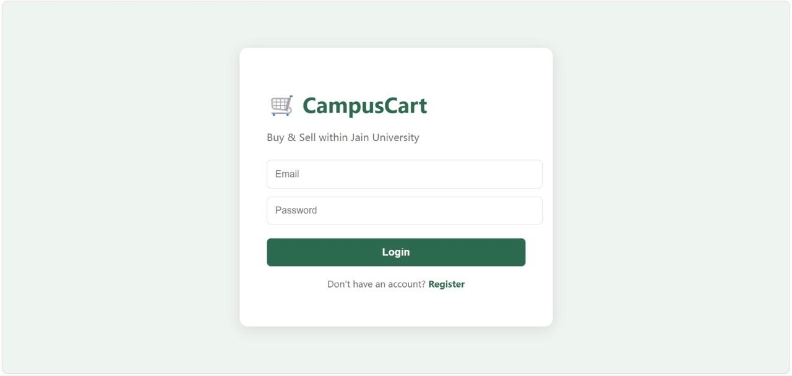
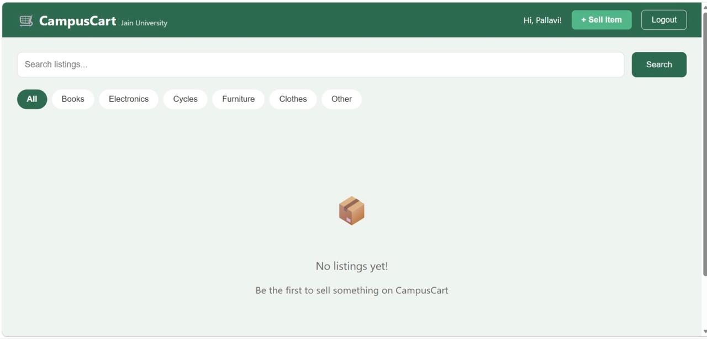
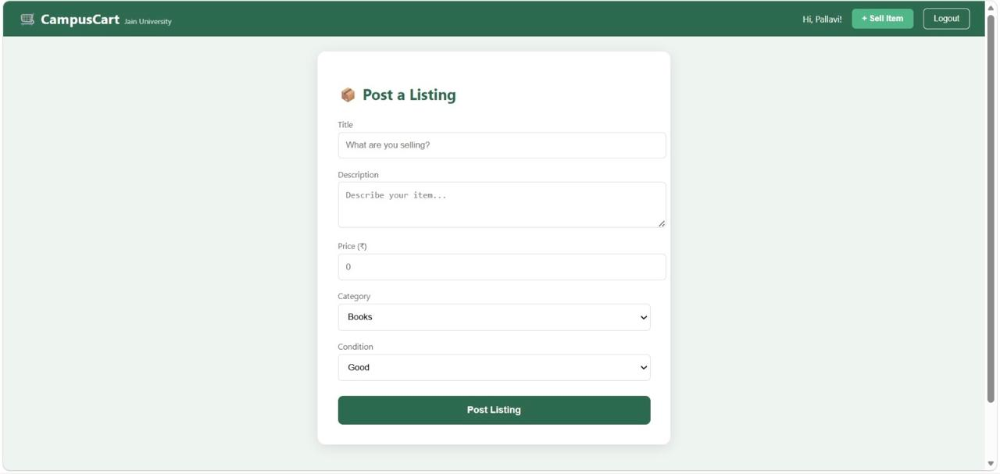
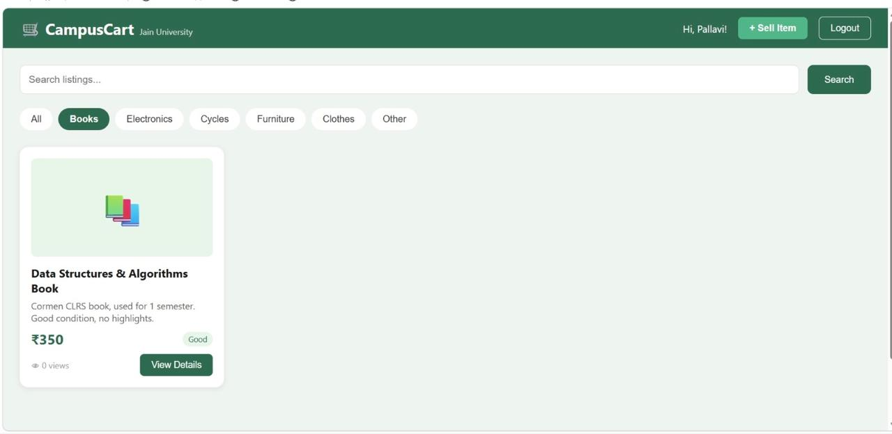

# 🛒 CampusCart — Hyperlocal Student Marketplace

A full-stack marketplace web application for college students to buy and sell second-hand items within their campus. Built with Spring Boot backend and React frontend.

## 📸 Screenshots

### Login Page

### Register Page

### Home Page

### Create Listing

## 🌟 Features

- 🔐 **User Authentication** — Register and login with encrypted passwords
- 📦 **Post Listings** — Sell books, electronics, cycles, furniture and more
- 🔍 **Search & Filter** — Search by keyword or filter by category
- 👁 **View Counter** — See how many students viewed your listing
- 🏷️ **Categories** — Books, Electronics, Cycles, Furniture, Clothes, Other
- ⏰ **Auto-expiry** — Listings expire after 30 days automatically

## 🛠️ Tech Stack

**Backend:**
- Java + Spring Boot
- Spring Security (BCrypt password hashing)
- Spring Data JPA + Hibernate
- H2 In-memory Database
- REST APIs

**Frontend:**
- React.js
- Axios (API calls)
- React Router DOM

## 📁 Project Structure